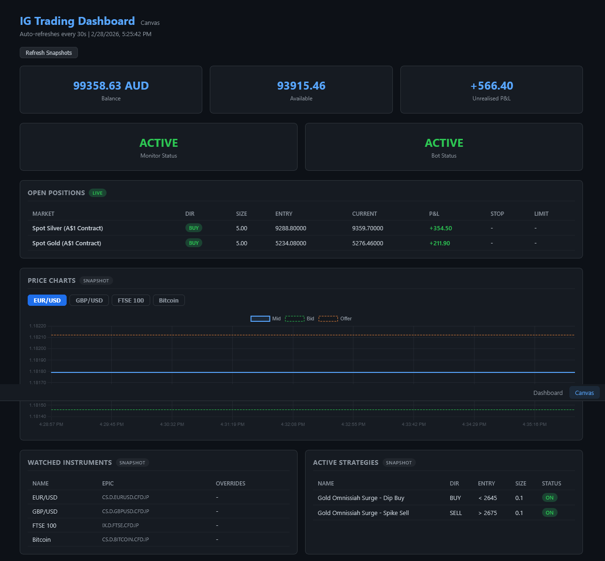
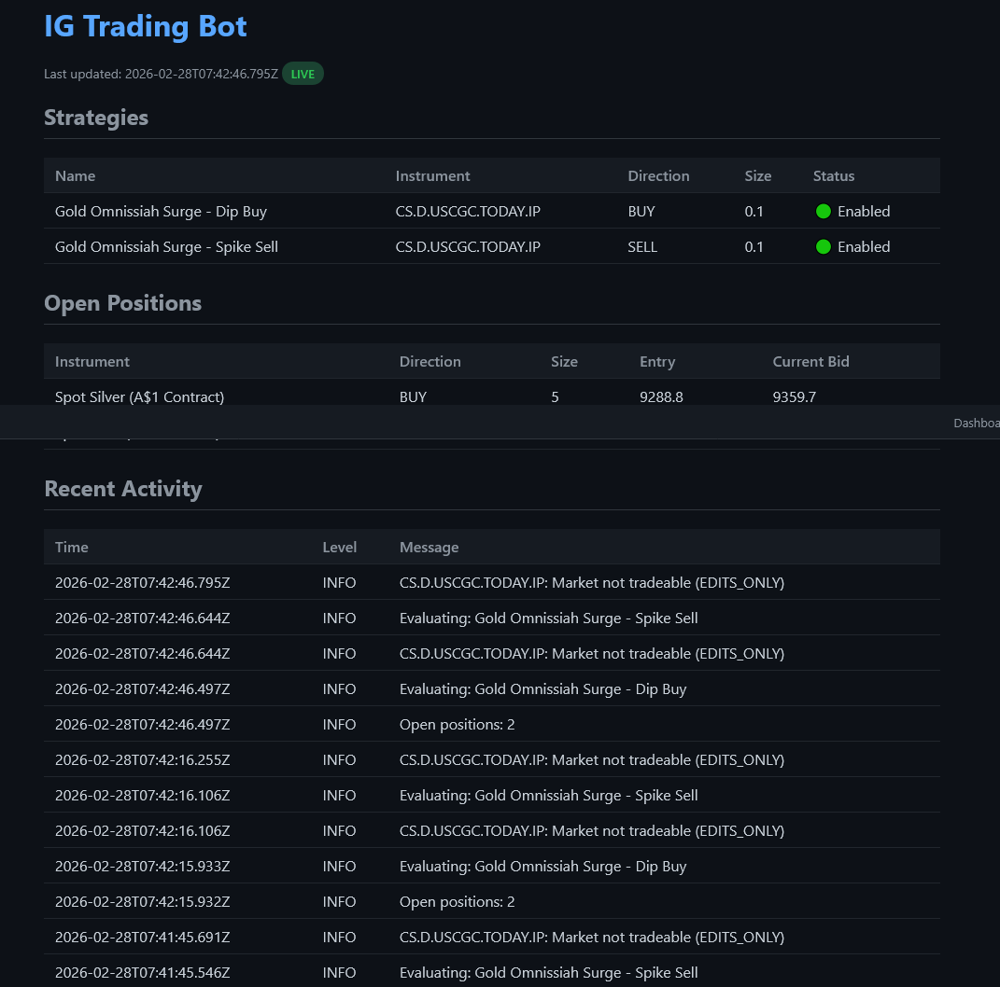
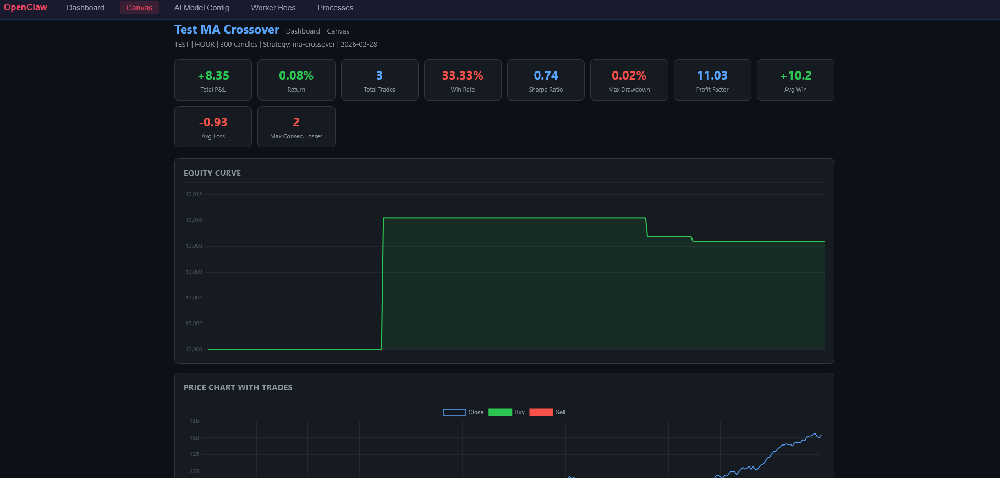
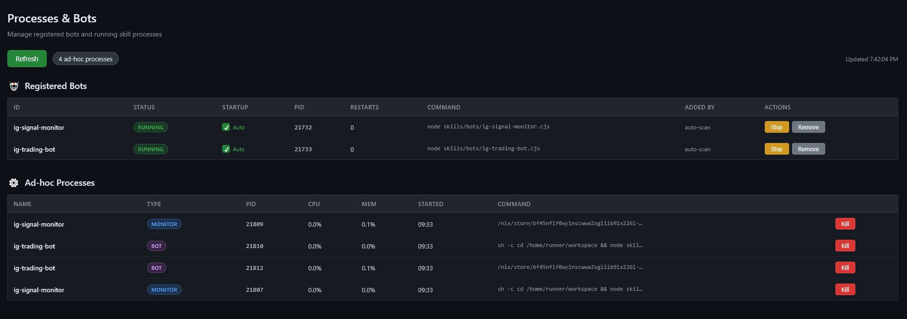

# OpenClaw Mechanicus Patch

  **A comprehensive trading extension for [OpenClaw](https://github.com/nicholasgriffintn/OpenClaw) — adds IG Trading integration, 23 automated strategies, ClawScript DSL, real-time dashboards, batch backtesting with genetic optimization, and AI-powered calibration.**

  

  ---

  ## What's Included

  ### IG Trading Dashboard
  A full-featured HTML5 trading dashboard served inside OpenClaw's canvas system. Live account overview, open positions, trade history, equity curve chart (via Lightweight Charts), and real-time price streaming via Lightstreamer WebSocket. Includes one-click session management for both demo and live IG accounts.

  

  ### ClawScript — Domain-Specific Trading Language
  ClawScript is a human-readable DSL for writing automated trading strategies without JavaScript. It compiles to executable JS and runs inside the Trade Claw engine.

  **Key features:**
  - Natural-language syntax: `IF RSI(prices, 14) < 30 THEN BUY AT MARKET`
  - 90+ built-in commands across 26 categories (trading, AI, data, agents, indicators, PRT compatibility)
  - Full flow editor with drag-and-drop strategy building
  - AI-assisted script generation via `AI_GENERATE_SCRIPT`
  - ProRealTime indicator compatibility (`PRT_RSI`, `PRT_MACD`, `PRT_BOLLINGER`, etc.)
  - Template library: RSI, EMA Crossover, Mean Reversion, Multi-Indicator, BTC Scalper, Sentiment Scan

  ### 23 Pre-Built Trading Strategies
  Each strategy has its own configurable schema, risk parameters, and ClawScript source:

  | Strategy | Type | Description |
  |---|---|---|
  | Scalper | Momentum | Fast in/out with RSI + EMA signals |
  | Momentum Scalper | Momentum | Multi-timeframe momentum detection |
  | Breakout | Trend | Donchian/Bollinger breakout entries |
  | Trend Following | Trend | EMA crossover trend riding |
  | Donchian Trend | Trend | Channel-based trend system |
  | Mean Reversion | Mean Reversion | Bollinger Band snap-back trades |
  | Swing Trading | Swing | Multi-day hold with ATR stops |
  | Position Trading | Long-term | Macro trend + fundamental overlay |
  | Grid Trader | Grid | Auto grid placement with position sizing |
  | Market Making | Market Making | Bid/ask spread capture |
  | Pairs Trading | Statistical | Correlated pair spread trading |
  | Arbitrage Scalper | Arbitrage | Cross-market price discrepancy |
  | Volatility Breakout | Volatility | ATR-based volatility expansion entries |
  | Carry Trade | Carry | Interest rate differential capture |
  | News Spike | Event | News-driven spike trading |
  | Sentiment Trader | Sentiment | AI sentiment analysis trades |
  | Hybrid ML | Machine Learning | ML-assisted signal generation |
  | Portfolio Optimizer | Portfolio | MPT-based allocation optimizer |
  | Seasonal Trader | Seasonal | Calendar-based pattern trading |
  | Options Linked | Options | Options-informed spot trading |
  | Value Investing | Value | Fundamental value screen |
  | Custom BTC Test | Custom | Bitcoin-specific strategy template |
  | Bourse Index Trackers | Index | Index tracking with rebalancing |

  ### Batch Backtesting with Genetic Optimization
  - Run single or batch backtests against IG historical price data
  - Optimization agent with genetic algorithm parameter search
  - Multi-cycle optimization with memory (`optimization_memory` DB table)
  - Sharpe ratio, win rate, profit factor, max drawdown tracking
  - Equity curve visualization with interactive charts

  

  ### AI Calibration
  - Groq-powered strategy parameter tuning
  - Automatic indicator threshold optimization
  - AI-generated trading signals with confidence scoring
  - Self-improving strategy loop via `AI_QUERY` and `ANALYZE_LOG`

  ### Live Signal Monitor
  - Real-time price streaming for configured instruments
  - Configurable alerts: price drops, spikes, breakouts, custom thresholds
  - Multi-instrument monitoring (Gold, Silver, Bitcoin, and more)
  - Automatic position proof-reading with duplicate/risk checks

  ### CEO Proxy with Web UI
  - Secure proxy layer with login authentication
  - Web-based Config, Workers, and Processes management pages
  - API key management for external worker connections
  - Agent workspace browser with file upload/download
  - Real-time bot registry with start/stop/remove controls

  

  ### Lightstreamer Integration
  - Real-time L1 price streaming via WebSocket
  - Automatic live/demo account detection
  - Candle aggregation from tick data (1s to 1h)
  - Hybrid polling fallback for CFD accounts
  - Dual streaming: demo for trading, live for market data

  ### ProRealTime Compatibility
  - PRT indicator functions (`PRT_RSI`, `PRT_MACD`, `PRT_ATR`, `PRT_ICHIMOKU`, etc.)
  - PRT drawing commands (`PRT_DRAWLINE`, `PRT_DRAWARROW`)
  - Convert PRT strategies to ClawScript

  ### Agent Workspace System
  - Pre-configured IG trading agent with full documentation
  - Strategy rulebooks, trade verification protocols, skill references
  - Self-contained workspace with `AGENTS.md`, `TOOLS.md`, `IDENTITY.md`, `SOUL.md`
  - ClawScript rules and syntax reference included

  ---

  ## Quick Install (Windows PowerShell)

  One-liner that downloads and installs everything:

  ```powershell
  Invoke-WebRequest -Uri "https://raw.githubusercontent.com/JoeSzeles/openclaw-mechanicus-patches/main/install-node.cjs" -OutFile "$env:TEMP\mechanicus-install.cjs"; node "$env:TEMP\mechanicus-install.cjs"
  ```

  The installer:
  - Detects your OpenClaw npm installation automatically
  - Downloads ~220 files (strategies, skills, dashboard, ClawScript editor, agent workspace)
  - Creates a `.env` file from the included template
  - Patches navigation into the control UI
  - Shows setup instructions on completion

  ## Manual Install

  **Linux / Mac:**
  ```bash
  git clone https://github.com/JoeSzeles/openclaw-mechanicus-patches.git
  cd openclaw-mechanicus-patches
  bash install.sh /path/to/openclaw
  ```

  **Windows (PowerShell):**
  ```powershell
  git clone https://github.com/JoeSzeles/openclaw-mechanicus-patches.git
  cd openclaw-mechanicus-patches
  .\install.ps1
  ```

  ## Post-Install

  Install required dependencies in your OpenClaw folder:

  ```bash
  npm install pg lightstreamer-client-node
  ```

  ## Configuration

  Edit the `.env` file created by the installer:

  | Variable | Required | Description |
  |---|---|---|
  | `IG_API_KEY` | Yes | IG Trading API key ([Get one here](https://labs.ig.com)) |
  | `IG_USERNAME` | Yes | IG account username |
  | `IG_PASSWORD` | Yes | IG account password |
  | `IG_ACCOUNT_ID` | Yes | IG account ID |
  | `IG_ACCOUNT_TYPE` | No | `demo` (default) or `live` |
  | `DATABASE_URL` | Recommended | PostgreSQL connection string (enables optimization memory) |
  | `GROQ_API_KEY` | No | Groq API key for AI calibration features |
  | `OPENCLAW_LOGIN_USER` | No | Web UI login username |
  | `OPENCLAW_LOGIN_PASSWORD` | No | Web UI login password |

  ## Starting

  ```powershell
  cd "C:\Users\YourName\AppData\Roaming\npm\node_modules\openclaw"
  .\start-mechanicus.ps1
  ```

  Then open: **http://localhost:5000**

  ## Architecture

  ```
  Port 5000 — CEO Proxy (auth, IG API, bot management, WebSocket relay)
  Port 5001 — OpenClaw Gateway (agents, chat, canvas, workspace)
  ```

  The CEO proxy handles IG authentication, live streaming, bot lifecycle, and serves the web UI. The gateway handles agent sessions, canvas pages, and the ClawScript runtime.

  ## File Structure

  ```
  files/
  ├── ceo-proxy.cjs              # Main proxy server
  ├── start-mechanicus.ps1/.bat   # Startup scripts
  ├── .env.example                # Environment template
  ├── openclaw.json               # Gateway configuration
  ├── skills/
  │   ├── bots/                   # Trading engine + strategies
  │   │   ├── trade-claw-engine.cjs
  │   │   ├── ig-scalper-engine.cjs
  │   │   ├── ig-optimization-agent.cjs
  │   │   ├── ig-scalper-backtest.cjs
  │   │   └── strategies/         # 23 strategy modules
  │   ├── ig-trading/             # IG API skill
  │   ├── ig-backtest/            # Backtesting skill
  │   ├── ig-signal-monitor/      # Signal monitoring skill
  │   ├── ig-trading-bot/         # Bot management skill
  │   └── clawscript/             # ClawScript documentation
  ├── ui/public/                  # Web UI pages
  │   ├── model-config.html/js    # IG configuration page
  │   ├── processes.html/js       # Bot/process manager
  │   ├── workers.html/js         # Worker management
  │   └── nav-inject.js           # Navigation bar
  ├── clawscript-installer/       # ClawScript editor + templates
  │   ├── editor/                 # Flow editor UI
  │   ├── lib/                    # Parser, compiler, runtime
  │   ├── templates/              # Strategy templates (.cs)
  │   └── strategies/             # Compiled strategy modules
  ├── .openclaw/
  │   ├── canvas/                 # Dashboard HTML + JS
  │   │   ├── ig-dashboard.html   # Main IG dashboard
  │   │   ├── ig-scalper-ui.js    # Dashboard logic
  │   │   └── ig-backtest-ui.js   # Backtest visualization
  │   └── workspace-ig/           # IG agent workspace
  │       ├── AGENTS.md           # Agent system access guide
  │       ├── CLAWSCRIPT-RULES.md # ClawScript syntax reference
  │       ├── SKILLS-IG.md        # IG skills reference
  │       ├── STRATEGIES.md       # Strategy log
  │       └── TOOLS.md            # Tools & canvas publishing
  └── docs/
      └── IG_TRADING_SETUP.md     # Setup guide
  ```

  ## Tech Stack

  - **Runtime**: Node.js (CommonJS)
  - **Trading API**: IG REST API v3 + Lightstreamer WebSocket
  - **Database**: PostgreSQL (optional, for optimization memory)
  - **AI**: Groq API (optional, for calibration)
  - **Charts**: Lightweight Charts (TradingView)
  - **DSL**: ClawScript (custom parser + compiler)
  - **Streaming**: Lightstreamer client for real-time market data

  ## License

  MIT

  ---

  **Built for [OpenClaw](https://github.com/nicholasgriffintn/OpenClaw)** — the open-source AI agent framework.
  